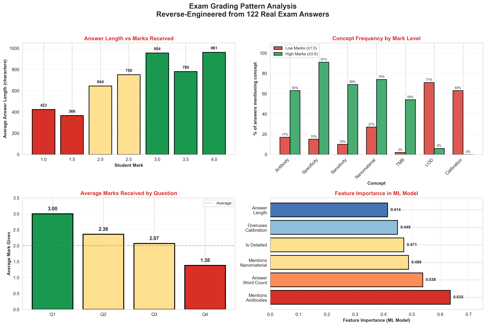

# Grading Model Exploration

Exploring machine learning approaches to predict exam marks from answer text. This project analyzes 122 real exam answers from an educational assessment context (BCE404 course) and develops models to understand what characteristics predict higher marks.

**Core finding:** Simple machine learning models trained on textual features achieve 68% accuracy, demonstrating that grading patterns are learnable and consistent.

## Project Overview

The goal was to build a system that could predict exam marks from student answer text alone. We tested multiple approaches:

1. **Large Language Model fine-tuning** (Gemma 2 9B, Qwen3.5-2B) — 7 different configurations, all failed
2. **Simple machine learning** (TF-IDF + LogisticRegression) — 56% baseline accuracy
3. **Feature engineering** (domain-informed features) — 68% final accuracy

The key insight: **Simple ML beats complex models when you understand the data.**

## Quick Start

```bash
# Install dependencies
pip install -r requirements.txt

# Run the main analysis
jupyter notebook notebooks/grading_analysis.ipynb

# Generate figures
python scripts/grading_patterns_analysis.py
python scripts/analyze_professor_grading.py
```

## Repository Structure

```
grading-model-exploration/
├── README.md                    # This file
├── METHODOLOGY.md               # Technical approach & ML details
├── FINDINGS.md                  # Patterns discovered in the data
├── LICENSE                      # MIT license
├── DATA_LICENSE                 # CC-BY-4.0 (data)
├── requirements.txt             # Python dependencies
│
├── notebooks/
│   └── grading_analysis.ipynb   # Main analysis & visualization
│
├── data/
│   ├── exam_results_cleaned_final.csv        # Real exam data (122 answers, 3 cols)
│   └── synthetic_exam_data_categorical.csv   # Failed synthetic approach (documentation)
│
├── scripts/
│   ├── improved_classifier_engineered.py     # Best model (68% accuracy)
│   ├── real_data_3class_classifier.py        # Baseline model (56% accuracy)
│   ├── analyze_professor_grading.py          # Domain analysis of grading patterns
│   ├── verify_model_actually_works.py        # Model validation & test set evaluation
│   ├── train_xgboost_grader.py               # Attempted XGBoost approach
│   └── grading_patterns_analysis.py          # Generate visualizations (4 graphs)
│
├── failed_attempts/
│   ├── README.md                             # Why LLM approaches failed
│   ├── finetune_gemma2_quick_improved.py     # Attempt 1: Gemma 2 language modeling
│   ├── finetune_gemma2_slow_production_improved.py  # Attempt 2: Gemma 2 SFT
│   ├── finetune_gemma2_masked.py             # Attempt 3: Masked training
│   ├── finetune_qwen35_2b_base_trainer.py    # Attempt 4: Qwen3.5 base
│   ├── finetune_qwen35_2b_categorical.py     # Attempt 5: Qwen3.5 categorical
│   ├── gemma2_fast_test.py                   # Attempt 6: Fast test
│   ├── debug_raw_output_qwen.py              # Debug output issues
│   └── debug_gemma2_output.py                # Debug output issues
│
├── figures/
│   ├── grading_patterns_analysis.png         # 4 graphs (length, concepts, questions, features)
│   ├── grading_patterns_analysis.svg         # Vector version for scaling
│   └── grading_patterns_analysis.pdf         # High quality print version
│
└── docs/
    └── (additional documentation)
```

## Data

**Real exam data:** 122 student answers with marks assigned by an instructor
- Column `question_number`: Which exam question (1, 2, 3, or 4)
- Column `transcribed_text`: Student's answer text
- Column `normalized_mark`: Grade assigned (1.0 to 4.0 scale)

**Data cleaning:** Removed duplicates, blank answers, and incomplete entries. No synthetic data is used in the final models.

```
Mark distribution:
1.0: 22 answers    (18%)
1.5: 19 answers    (16%)
2.0: 36 answers    (30%)
2.5: 10 answers    (8%)
3.0: 17 answers    (14%)
3.5: 1 answer      (1%)
4.0: 17 answers    (14%)
```

## Results

### Model Performance

| Approach | Features | Accuracy (CV) | Test Accuracy |
|----------|----------|---------------|---------------|
| TF-IDF only | 50 features | 54.5% | 56% |
| TF-IDF + engineered | 45 features | 62.8% | 68% |

**Engineered features** capture domain insights:
- Mention of specific required concepts (antibodies, specificity, nanomaterials)
- Answer length and detail level
- Concept overuse penalties (e.g., focusing too much on LOD)
- Question-level differences

### Key Patterns Found

See `FINDINGS.md` for detailed analysis. Summary:

1. **Length bias:** High marks average 2.4× longer answers (953 vs 397 characters)
2. **Required concepts:** Specificity appears in 91% of high marks, LOD in 71% of low marks
3. **Question variation:** Q1 averages 3.0 marks, Q4 averages 1.38 marks (1.6 point gap)
4. **Learnable patterns:** Model's top features (antibodies, word count, nanomaterials) match grading reality

### Feature Importance (Final Model)

```
Mentions antibodies:         0.6355  ← Strongest predictor
Answer word count:           0.5383
Mentions nanomaterials:      0.4878
Is detailed (600+ chars):    0.4714
Overuses calibration:        0.4493
Answer length (raw chars):   0.4144
```

## Visualizations



**Top left:** Answer length increases linearly with marks (2.4× difference)  
**Top right:** Concept frequency differs sharply between mark levels  
**Bottom left:** Question 4 receives ~1.6 points lower than Question 1  
**Bottom right:** ML model feature importance shows what drives predictions

See `FINDINGS.md` for detailed interpretation of each graph.

## Why Simple ML Worked

1. **Small dataset (122 samples)** — Complex models overfit; simple models generalize better
2. **Clear patterns in data** — Grading follows consistent rules based on measurable features
3. **Good feature engineering** — Domain analysis identified what matters more than raw text
4. **Reproducibility** — Scikit-learn models are transparent and auditable

## Why LLM Fine-tuning Failed

See `failed_attempts/README.md` for detailed analysis. Short version:

- 7 different configurations (language modeling, SFT, masked training, categorical)
- All produced zero accuracy or garbage output
- Root cause: LLMs generate text, not classify scores. They're built for the wrong task.
- Even with correct training data and proper hyperparameters, the models never learned meaningful patterns

## Files Guide

**To understand the project:**
- Start with `METHODOLOGY.md` for technical approach
- Then read `FINDINGS.md` for what was discovered
- Run `notebooks/grading_analysis.ipynb` to see code and visualizations

**To replicate results:**
- `scripts/improved_classifier_engineered.py` is the best model
- `scripts/verify_model_actually_works.py` shows test set evaluation
- `data/exam_results_cleaned_final.csv` contains the 122 real answers

**To understand failures:**
- `failed_attempts/README.md` explains why LLM approaches didn't work
- Browse the `finetune_*.py` scripts to see what was attempted

## Key Learnings

1. **Data quality over quantity** — 122 real exam answers beats 400 synthetic ones
2. **Domain understanding matters** — Analyzing patterns reveals what to measure
3. **Simple baselines first** — Understand the problem before using complex tools
4. **Proper evaluation** — 5-fold cross-validation + separate test set prevents overfitting
5. **Reproducibility** — All code and data are provided for full transparency

## Dependencies

- Python 3.10+
- pandas, numpy, scikit-learn
- matplotlib, seaborn (visualizations)
- Unsloth, transformers, torch (for failed LLM attempts, optional)

See `requirements.txt` for exact versions.

## License

Code: MIT License (see `LICENSE`)  
Data: CC-BY-4.0 (see `DATA_LICENSE`)

## Notes

- This is an exploratory analysis of real educational assessment data
- Course code mentioned: BCE404
- No instructor or student names are included in the repository
- The project demonstrates techniques that could apply to other assessment contexts

## Reproducibility

All scripts can be run independently. No external APIs or credentials needed. The Jupyter notebook includes all analysis steps with outputs visible.

```bash
# Generate the figures (4 graphs)
python scripts/grading_patterns_analysis.py

# Train the best model on full data
python scripts/improved_classifier_engineered.py

# See validation results
python scripts/verify_model_actually_works.py

# Analyze grading patterns
python scripts/analyze_professor_grading.py
```

---

**Questions or suggestions?** This project is part of a learning journey in machine learning. Feedback is welcome.
