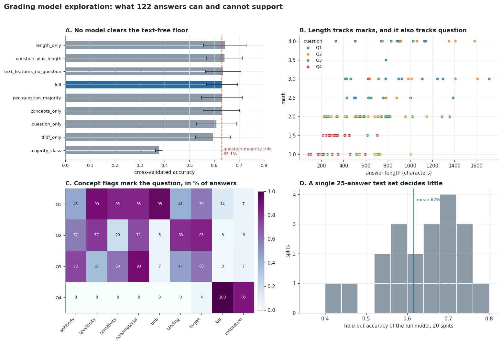

# Grading model exploration

Can a model predict the mark an instructor gave a handwritten exam answer, from
the answer text alone? This repository works that question on 122 real answers
from a biosensor course and reports what the data actually supports.

**Headline result: no.** The best text model reaches 63.2% cross-validated
accuracy on a 3-class target. A rule that reads no text at all, and predicts
each question's most common class, reaches 63.1%. Once the model knows which
question it is grading, the answer text adds nothing measurable at this sample
size.

That is the finding. This repository is written to make it checkable.



## What changed from the first version

The first version of this project reported 68% held-out accuracy and read it as
evidence that grading patterns are learnable. Three things were wrong with that.

1. **No baseline.** The 68% was never compared against predicting each
   question's majority class. That floor sits at 63.1% and the model does not
   clear it. Question 4 alone is 26 Low marks out of 28, so a model told the
   question number scores that question at 93% without reading a word.
2. **Leakage into the feature definitions.** The length thresholds (600 and 400
   characters) and the concept vocabulary were chosen by reading all 122
   answers, and then a held-out score was reported on 25 of those same answers.
   Those thresholds are now fitted per training fold.
3. **One split reported as a result.** With 122 rows an 80/20 split leaves 25
   test answers. Across 20 different stratified splits of the same data, the
   same model scores anywhere from 40% to 76%. The 68% was one draw from that
   spread.

The concept features carry a fourth problem. `mentions_lod` fires on 100% of Q4
answers and near 0% elsewhere. `mentions_tmb` fires on 95% of Q1 and near 0%
elsewhere. Read pooled across questions these look like a grading rubric. They
are question detectors. `FINDINGS.md` works through this.

## Results

Full tables in [`results/RESULTS.md`](results/RESULTS.md), regenerated by one
script. Cross-validation is repeated stratified 5-fold, 10 repeats, 50 fits per
model.

| Model | CV accuracy (mean ± sd) |
|---|---|
| `majority_class` | 0.377 ± 0.013 |
| `tfidf_only` | 0.594 ± 0.070 |
| `question_only` | 0.609 ± 0.081 |
| `concepts_only` | 0.630 ± 0.074 |
| `per_question_majority` | 0.631 ± 0.082 |
| `full` | 0.632 ± 0.064 |
| `text_features_no_question` | 0.636 ± 0.072 |
| `question_plus_length` | 0.641 ± 0.072 |
| `length_only` | 0.643 ± 0.086 |

Every model above the majority floor lands inside one standard deviation of
every other. The ordering is noise. `length_only` reads two numbers off the
text and matches the model with 47 features.

Comparing means is weak when the standard deviations overlap this much, so the
`full` model and the text-free `per_question_majority` baseline are also
differenced fold by fold across the same 50 folds.

| quantity | value |
|---|---|
| mean difference in accuracy | +0.0007 |
| folds where the full model wins | 20 of 50 |
| Wilcoxon signed-rank p | 0.965 |

The two are indistinguishable.

Out-of-fold predictions from the `full` model, by question, against the
text-free question-majority rule:

| Question | n | `full` model | Question-majority rule |
|---|---|---|---|
| Q1 | 29 | 0.586 | 0.586 |
| Q2 | 35 | 0.514 | 0.486 |
| Q3 | 30 | 0.500 | 0.567 |
| Q4 | 28 | 0.929 | 0.929 |
| **All** | 122 | **0.623** | **0.631** |

## What the data does support

Answer length correlates with mark inside each question, where question
identity cannot explain it. Pearson r on the training split runs 0.36 on Q1,
0.59 on Q2, 0.52 on Q3, 0.65 on Q4.

This is a correlation in 122 answers marked by one person on one paper. It is
consistent with longer answers covering more of the expected content, and it is
consistent with a length bias in the marking. This dataset cannot separate
those, and nothing in this repository should be read as showing that writing
more causes a higher mark.

## Repository layout

```
.
├── README.md              this file
├── METHODOLOGY.md         how the evaluation is set up and why
├── FINDINGS.md            the confounding, worked through
├── DATA_CARD.md           provenance, anonymization, consent, limitations
├── LICENSE                MIT, code
├── DATA_LICENSE           CC-BY-4.0, data
├── requirements.txt
│
├── data/
│   ├── exam_results_cleaned_final.csv        122 real answers, 3 columns
│   └── synthetic_exam_data_categorical.csv   400 generated answers, unused
│
├── src/grading/
│   ├── data.py            loading and the 3-class label definition
│   ├── features.py        transformers that fit their thresholds on train rows
│   └── models.py          the baseline ladder and the full model
│
├── scripts/
│   ├── evaluate.py        the only script that reports a metric
│   ├── explore.py         exploratory analysis, training split only
│   ├── make_figures.py    figures, drawn from results/metrics.json
│   └── check_docs.py      fails if the markdown drifts from the results
│
├── tests/                 pytest, including the leakage guarantees
│   ├── test_data.py
│   ├── test_leakage.py
│   └── test_evaluate.py
│
├── results/               generated
│   ├── metrics.json       every accuracy in the repository
│   ├── RESULTS.md
│   ├── exploration.json   every descriptive table in FINDINGS.md
│   └── EXPLORATION.md
│
├── figures/               generated
│   └── results_summary.{png,svg,pdf}
│
└── failed_attempts/       seven LLM fine-tuning runs, kept as a record
```

## Running it

```bash
pip install -e ".[dev]"
make                             # regenerate everything, then verify the write-up
make test                        # pytest
```

Or step by step:

```bash
python scripts/evaluate.py                    # results/metrics.json, results/RESULTS.md
python scripts/explore.py                     # results/exploration.json, results/EXPLORATION.md
python scripts/make_figures.py                # figures/results_summary.*
python scripts/check_docs.py --check-results  # verify the markdown, and the results
```

`scripts/evaluate.py` is the single source of every accuracy quoted in this
repository, and `scripts/explore.py` is the single source of every descriptive
table in `FINDINGS.md`. The tables in the markdown are copied from those two,
and `check_docs.py` verifies all 62 of them. Passing `--check-results` also
recomputes everything and confirms the committed files still match a fresh run,
comparing accuracies at the three decimals this repository reports. CI runs the
whole chain on every push, on Python 3.10 and 3.12.

The leakage guarantee is tested, not only asserted. `tests/test_leakage.py`
fails if the length thresholds stop being learned per fold, or if a sentinel
token planted in the held-out rows reaches the fitted vocabulary.

Rerunning with the default seed reproduces every reported number. Accuracies
agree to the three decimals quoted here. Exact agreement in the last bits of a
float depends on the BLAS build and the CPU, so it is not claimed. The library
versions each committed run used are recorded in `results/metrics.json`.

No API keys, no credentials, no GPU.

## The LLM fine-tuning attempts

`failed_attempts/` holds seven runs across Gemma 2 9B and Qwen3.5-2B that never
produced a usable prediction. Two crashed on processor and collator errors, one
emitted garbage tokens, the rest converged to constant output.

These runs failed. The reason is not that language models cannot classify. They
can, and the standard approaches are a classification head on the encoder, a
constrained decode over the label tokens, or a scored comparison of the
candidate labels. None of the seven runs did any of those. They were free-form
generation fine-tunes on 122 to 400 examples, several of them on synthetic
data, at hyperparameters that were never swept. Attempts 4 and 5 are ordinary
API bugs.

What the runs support is narrow. Seven specific configurations, built this way,
on this much data, did not work. `failed_attempts/README.md` says what each one
did.

## Limitations

- 122 answers, 4 questions, one instructor, one paper. Roughly 30 answers per
  question, and every per-question number rests on that.
- Marks and answer text both come from automated extraction with no measured
  error rate. See `DATA_CARD.md`.
- Q4 is 26 Low out of 28, so it carries almost no variation to model and it
  inflates any pooled accuracy.
- The 3-class banding of a 7-value ordinal mark discards information. An ordinal
  model on the raw marks was not tried.
- Nothing here transfers to another grader, another paper, or another course.

## Where this could go

The useful next step is more questions. Question identity accounts for the
signal on this data, so a dataset spanning several papers and more than one
marker would let the text carry something. Within the current data, an
ordinal model on the raw 1.0 to 4.0 marks, evaluated per question, is the one
untried idea that the sample size still permits.

## Licence

Code MIT, data CC-BY-4.0. Read `DATA_CARD.md` before reusing the data.
